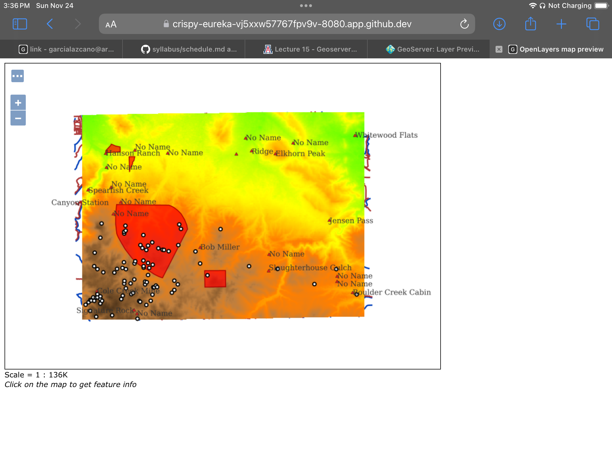

#### Q1: What is the URL of the WMS GetCapabilities request?

https://crispy-eureka-vj5xxw57767fpv9v-8080.app.github.dev/geoserver/ows?service=WMS&version=1.3.0&request=GetCapabilities

#### Q2: What is the URL of the WFS GetCapabilities request?

https://crispy-eureka-vj5xxw57767fpv9v-8080.app.github.dev/geoserver/ows?service=WFS&acceptversions=2.0.0&request=GetCapabilities

#### Q3: Submit a screenshot of your updated WFS Layer Preview

#### Q4: What does drawing order refer to? Which layer goes on `top`, the first or the last layer in the list?

Drawing order refers to the sequence or order in which the map layers are displayed, in other words which layer goes on top of the other. The last layer will go on `top` while the first layer will be at the bottom. 

#### Q5: Submit a screenshot of the Layer Preview of the Spearfish Layer Group when sf:sfdem is listed as the 3rd layer.

#### Q6: What is the WMS url for the single-tiled request?

https://crispy-eureka-vj5xxw57767fpv9v-8080.app.github.dev/geoserver/wms?SERVICE=WMS&VERSION=1.1.1&REQUEST=GetMap&FORMAT=image%2Fpng&TRANSPARENT=true&STYLES&LAYERS=spearfish&exceptions=application%2Fvnd.ogc.se_inimage&SRS=EPSG%3A26713&WIDTH=769&HEIGHT=540&BBOX=584806.3797656847%2C4910708.364669101%2C614140.6110508998%2C4931300.35367905

#### Q7: What is the WMS url for one of the tiled requests? What is the image size?

The image size is: 256x256

https://crispy-eureka-vj5xxw57767fpv9v-8080.app.github.dev/geoserver/wms?SERVICE=WMS&VERSION=1.1.1&REQUEST=GetMap&FORMAT=image%2Fpng&TRANSPARENT=true&tiled=true&STYLES&LAYERS=spearfish&exceptions=application%2Fvnd.ogc.se_inimage&tilesOrigin=589425.9342365642%2C4913959.224611808&WIDTH=256&HEIGHT=256&SRS=EPSG%3A26713&BBOX=596152.2068582997%2C4925585.446829237%2C605925.1938559767%2C4935358.433826914

#### Q8: What is the URL of your coarse resolution sample of a WMTS url? What level does this tile refer to? Notice the differences. What are some of the fields that are unique to this url?

https://crispy-eureka-vj5xxw57767fpv9v-8080.app.github.dev/geoserver/gwc/service/wmts?layer=spearfish&style=&tilematrixset=EPSG%3A4326&Service=WMTS&Request=GetTile&Version=1.0.0&Format=image%2Fpng&TileMatrix=EPSG%3A4326%3A15&TileCol=13879&TileRow=8301

This tile refers to the `Level 0`

Some of the unique fields to this URL are that the coarse resolution sample has the tile row and tile column, while the WMS url has the width and height of the png and the coordinates of the tile. The WMS url also has a different type of request "get map" while the WMTS url has a "get tile" request. 

#### Q9: In the zoomed-out URL, what are the TileCol and TileRow?

TileCol: 3465

TileRow: 2072

#### Q10: In the zoomed-in URL, what are the TileCol and TileRow?

TileCol: 13870

TileRow: 8289

#### Q11: Why are they so different for the same location in the map?

They are so different even though it is for the same location on the map given that, the more zoomed the more tile the matrix is divided into, and therefore the higher the TileCol and TileRow, and vise versa, the more zoomed out you are the less tiles the matrix is dividing the image into and the lower the TileCol and TileRow are. 

#### Q12: Is there a difference in the TileMatrix? %3A is an HTML encoding for a colon, `:`.What does the number after EPSG:4326 mean?

Yes, there is a difference in the TileMatrix given that it represents the different zoom levels of the tiles. The number after EPSG:4326 refers to the zoom level within the TileMatrix starting from 0. In this case the zoomed in URL shows a 15 while the zoomed out URL has a 13. 